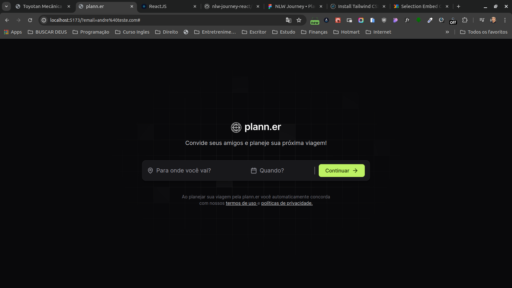
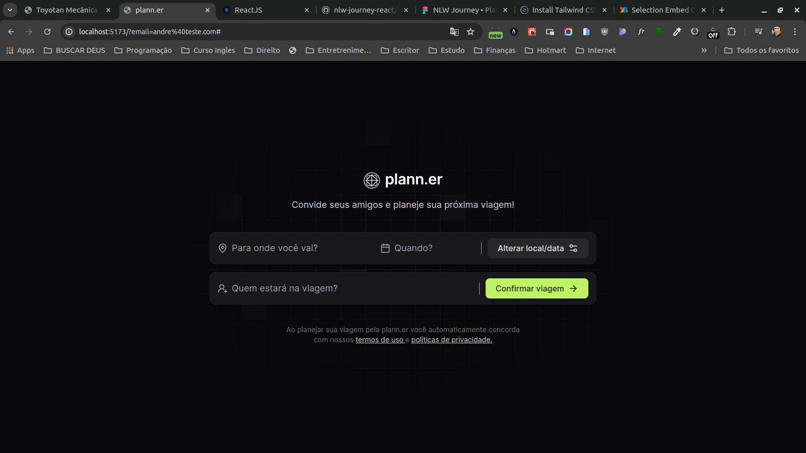
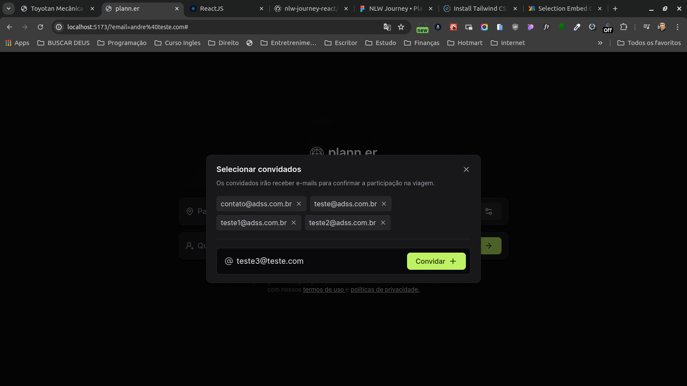
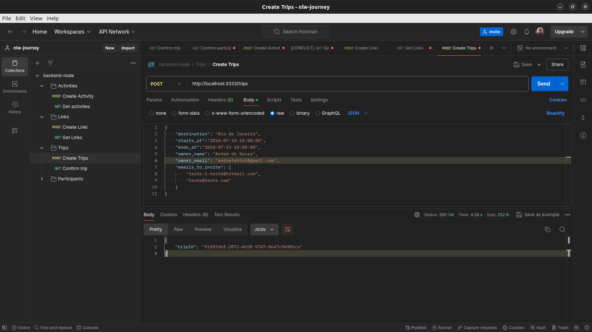

 
  <h1 align="center">Projects built during the NLW-Journey in 2024. Made with 💜 at Rocketseat.</h1>
  
  
  
  
   

  

    🔗 <a href="https://github.com/Andreoew/nlw-journey/tree/main/backend">Link to backend</a> 🔗
     
     
    🔗 <a href="https://github.com/Andreoew/nlw-journey">Link to frontend</a> 🔗
  
  

  <!-- Write here what the project is about. -->
  <h1 align="center">About</h1>
  The project is a backend for a travel management system among friends. With it, participants can create trips, invite friends, and manage activities during the trip. Guests receive confirmation links via email to confirm their participation. The API was developed in Node.js with TypeScript.

🚧 Under Construction 🚧
[] Frontend in React with NextJS

